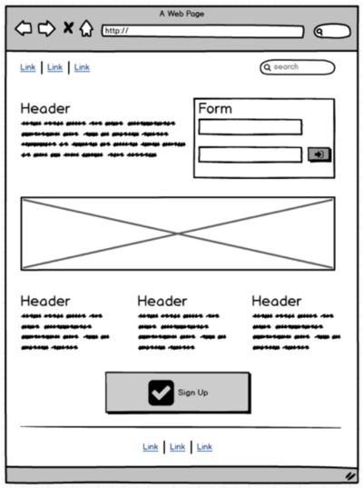
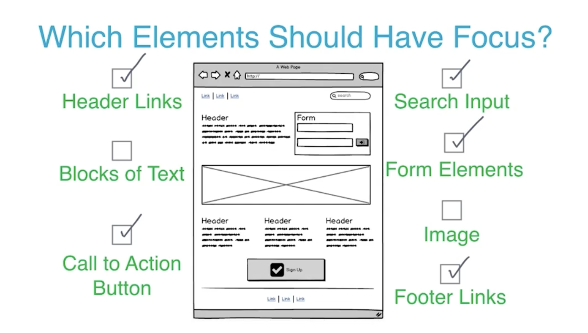

# Udacity Web Accessibility Notes

---
## 1. Introduction

Good accessibility or "a11y" is crucial to making sure all users can access the content in your sites and applications. Making sure you consider accessibility at the start of your process will ensure that your final product is more polished and works for more people.

**Note**: We often shorten the word "accessibility" to "a11y" because there are 11 letters between the "A" and "Y" in the word "Accessibility". Sometimes you'll see this pattern used in other contexts like i18n for "internationalization" and l10n for "localization".

### Understanding the diversity of users

Some statistics on disability for the US:

- Around 2% of the population has some kind of vision disability (i.e. are blind or have significant difficulty seeing even with glasses)
- Around 50% of the population has some kind of clinically significant refractive error (a visual impairment which may be corrected with glasses if mild enough)
- Around 8% of males and 0.5% of females have some form of color vision deficiency
- Around 2% of adults have a hearing disability
- Over 4% have a cognitive disability (difficulty remembering, concentrating, or making decisions)

Sources:

- [Disability Compendium](https://disabilitycompendium.org/)
- ["The Perception of Color"](https://www.ncbi.nlm.nih.gov/books/NBK11538/)
- ["Prevalence of Refractive Error in the United States, 1999-2004"](http://archopht.jamanetwork.com/article.aspx?articleid=420707)


Checklists:

- [Web Content Accessibility Guidelines 2.0 (WCAG)](https://www.w3.org/TR/WCAG20/)
- [Web Aim Checklist for WCAG 2.0](https://webaim.org/standards/wcag/checklist)

---
## 2. Focus

WebAIM checklist items:

- 2.1.1: http://webaim.org/standards/wcag/checklist#sc2.1.1

### What is Focus?

Move focus around the page using your keyboard:

- `TAB` will move focus forward
- `SHIFT - TAB` will move focus backwards
- `Arrow keys` can be used to navigate inside of a component
- https://html.spec.whatwg.org/multipage/interaction.html#focus-management

### DOM Order Matters

WebAIM checklist items:

- 1.3.2: http://webaim.org/standards/wcag/checklist#sc1.3.2

### Using TabIndex

`tabindex` on [MDN](https://developer.mozilla.org/en-US/docs/Web/HTML/Global_attributes/tabindex)

https://html.spec.whatwg.org/multipage/interaction.html#sequential-focus-navigation-and-the-tabindex-attribute

### Which Elements Should Have Focus?

We should typically only add `tabindex` attributes to interactive elements, and not to our site content.With this in mind, consider a web page that looks like the following:



Solution



### Skip Links

You can [read more about skip links](https://webaim.org/techniques/skipnav/) in this article on the Web AIM site.

https://developers.google.com/web/updates/2016/03/focus-start-point?hl=en

### Keyboard Design Patterns (Radio Group)

Take a look at the ARIA Authoring Best Practices guide to read more about the Radio pattern.

[ARIA Authoring Best Practices (Radio Group)](https://www.w3.org/WAI/ARIA/apg/patterns/radiobutton/)

### Offscreen Content

To find your missing focus you can type the following into your console:

`document.activeElement`

[Read more about Document.activeElement on MDN](https://developer.mozilla.org/en-US/docs/Web/API/Document/activeElement)

### Modals And Keyboard Traps

WebAIM checklist items:

- 2.1.2: http://webaim.org/standards/wcag/checklist#sc2.1.2

`<dialog>` [on MDN](https://developer.mozilla.org/en-US/docs/Web/HTML/Element/dialog)

---
## 3. Semantics Basics


### The Accessibility Tree

Matching a Simple DOM and A11y Tree


### Writing Semantic HTML

For example:

```html
<!-- bad -->
<input type="radio" checked name="tType" value="0">

<!-- good -->
<label>
  <input type="radio" checked name="tType" value="0">
  Round Trip
</label>

<!-- good -->
<input type="radio" checked name="tType" value="0" id="round-trip">
<label for="round-trip">Round Trip</label>
```

WebAIM Guideline 1.1: http://webaim.org/standards/wcag/checklist#g1.1

The [MDN page on](https://developer.mozilla.org/en-US/docs/Web/HTML/Element/label) `<label>` demonstrates the two options for associating a `<label>` with the thing it's labelling.

The W3C spec has [a list of what types of elements work with a `<label>` tag.](https://html.spec.whatwg.org/multipage/forms.html#category-label)

### Text Alternatives

WebAIM checklist items:

- 1.3.2: http://webaim.org/standards/wcag/checklist#sc1.3.2
- 2.4.10: http://webaim.org/standards/wcag/checklist#sc2.4.10
- 1.3.1: http://webaim.org/standards/wcag/checklist#sc1.3.1
- 2.4.1: http://webaim.org/standards/wcag/checklist#sc2.4.1
- 2.4.6: http://webaim.org/standards/wcag/checklist#sc2.4.6

JavaScript headings snippet:

```javascript
const hs = document.querySelectorAll('h1,h2,h3,h4,h5,h6');
for (let i = 0; i < hs.length; i++) {
   console.log(hs[i].textContent.trim() + " " +  
               hs[i].tagName,
               hs[i]);
}
```

### Labeling Images With `alt` Text


For each of the labeled portions of the page, provide some alternate text where necessary, and a blank alt attribute otherwise.


**A:** alt="shopping cart"
**B:** alt="koala munchies"
**C:** alt=""
**D:** alt="cider gum"
**E:** alt=""

---

## 4. Navigating Content

### Navigating with a screen reader

Shortcuts mentioned:

- `CMD` + `F5` to turn on VoiceOver on OS X
Normal keyboard operation (`TAB`, `Shift` + `TAB`, arrow keys etc.) work as normal with VoiceOver running
- `CMD` + `L` to jump to address bar
- `CTRL` + `Option` + `U` to open Web Rotor
Type search term with Web Rotor open to search within Web Rotor
- `CTRL` + `Option` + `←` `↑` `↓` `→` to explore content
- `CTRL` + `Option` + `CMD` + `H` to move forward by heading
- `CTRL` + `Option` + `CMD` + `Shift` + `H` to move backward by heading

[WebAIM's article on Using VoiceOver to evaluate Web Accessibility](https://webaim.org/articles/voiceover/) has a full introduction to VoiceOver from the point of view of evaluating accessibility, including most keyboard commands available.

If you don't have a Mac device, [NVDA](https://www.nvaccess.org/) is a free, open source screen reader available for Windows. [WebAIM's introduction to NVDA](https://webaim.org/articles/nvda/) covers the basics of using NVDA to check accessibility.

If you only use Linux, [Orca](https://help.gnome.org/users/orca/stable/) is available in the Gnome desktop manager, although this screen reader is much more rarely used and suffers from poor support by web browsers.

### Using Headings

WebAIM checklist items:

- 1.3.2: http://webaim.org/standards/wcag/checklist#sc1.3.2
- 2.4.10: http://webaim.org/standards/wcag/checklist#sc2.4.10
- 1.3.1: http://webaim.org/standards/wcag/checklist#sc1.3.1
- 2.4.1: http://webaim.org/standards/wcag/checklist#sc2.4.1
- 2.4.6: http://webaim.org/standards/wcag/checklist#sc2.4.6

JavaScript headings snippet:

```javascript
for (let i = 0, headings = $$('h1,h2,h3,h4,h5,h6');
     i < headings.length; i++) {
   console.log(headings[i].textContent.trim() + " " +  
               headings[i].tagName,
               headings[i]);
}
```

### Other navigational options example

Shortcuts mentioned:

- `CTRL` + `Option` + `U` to open Web Rotor
- `←` and `→` to change panes within Web Rotor
- Type search term with Web Rotor open to search within Web Rotor
- Enter to move VoiceOver focus to item from Web Rotor
- `CTRL` + `Option` + `Spacebar` to activate link/button/other element
- `CTRL` + `Option` + `←` `↑` `↓` `→` to explore content
- `CTRL` + `Option` + `CMD` + `H` to move forward by heading
- `CTRL` + `Option` + `CMD` + `Shift` + `H` to move backward by heading
- `CTRL` + `Option` + `W` to have a word spelled out

WebAIM's article on `accesskey`: http://webaim.org/techniques/keyboard/accesskey

WebAIM's articles on VoiceOver and NVDA:

- http://webaim.org/articles/voiceover/
- http://webaim.org/articles/nvda

### Link Text

WebAIM checklist item 2.4.9: http://webaim.org/standards/wcag/checklist#sc2.4.9

---

## 5. ARIA

[ARIA spec](https://www.w3.org/TR/wai-aria-1.1/)

### Roleplaying

ARIA 1.0 roles: https://www.w3.org/TR/wai-aria-1.0/#roles

ARIA 1.1 roles (draft): https://www.w3.org/TR/wai-aria-1.1/#roles

ARIA 1.1 practices guide (draft): https://www.w3.org/TR/wai-aria-practices-1.1/

### Name That Element!

We've covered several ways to label elements already, and we just learned about two more: `aria-label`, and `aria-labelledby`.

For this exercise, we're going to see some of those labeling techniques in action! We'll put our skills to the test by figuring out the accessible name for a few elements.

Instructions
In each case, provide the label for the first (i.e., outermost) element. If the element would be hidden from the accessibility tree, type in **No label** as your answer. Note that HTML labelling techniques, and ARIA roles and attributes, must be used correctly in order to be effective!

Question 1:

```html
<button aria-lavbel="Gumnut">
  Eucalyptus
</button>
```

<details>
  <summary>Answer</summary>

  Answer: Gumnut
</details>

Question 2:

```html
<div role="button">
  Wombat
</div>
```

<details>
  <summary>Answer</summary>

  Answer: Wombat
</details>

Question 3:

```html
<input type="checkbox" name="roo">
<label for="roo">
  Kangaroo
</label>
```

<details>
  <summary>Answer</summary>

  Answer: No label
</details>

Question 4:

```html
<span role="checkbox"
  aria-checked="false"
  aria-labelledby="label"
  aria-label="Not checked"></span>
<span id="label">Wallaby</span>
```

<details>
  <summary>Answer</summary>

  Answer: Wallaby
</details>

### Default Semantics and Landmarks

ARIA in HTML spec, including guidance on what ARIA roles may and may not be used with which HTML elements: https://www.w3.org/TR/html-aria/

### ARIA relationship attributes

[ARIA relationship attributes](https://www.w3.org/TR/wai-aria-1.1/#attrs_relationships)

### Hidden In Plain Sight

For more information on screen reader-only text, check out [WebAIM's article on "invisible content"](https://webaim.org/techniques/css/invisiblecontent/).

### Name That Element: Round 2

In each case, provide the label for the first (i.e., outermost) element. If the element would be hidden from the accessibility tree, type in No label as your answer. Note that HTML labelling techniques, and ARIA roles and attributes, must be used correctly in order to be effective!

Here are some resources that may help you along the way:

- [`aria-hidden`definition](https://www.w3.org/TR/wai-aria-1.1/#aria-hidden)
- [HTML5 `hidden` definition](https://html.spec.whatwg.org/multipage/interaction.html#the-hidden-attribute)
  - [Discussion of the difference between `aria-hidden` and `hidden`](https://www.tpgi.com/html5-accessibility-chops-hidden-and-aria-hidden/)
- [`aria-labelledby` definition](https://www.w3.org/TR/wai-aria-1.1/#aria-labelledby)
  - Recall that `aria-labelledby` may refer to elements otherwise hidden from the accessibility tree
- [`treeitem` role](https://www.w3.org/TR/wai-aria-1.1/#treeitem)
- [`button` role](https://www.w3.org/TR/wai-aria-1.1/#button)
- [`checkbox` role](https://www.w3.org/TR/wai-aria-1.1/#checkbox)

Question 1:

```html
<div role="treeitem" aria-hidden>
  Semantics
</div>
```

<details>
  <summary>Answer</summary>

  Answer: Semantics
</details>

Question 2:

```html
<button hidden>
  Sign up
</button>
```

<details>
  <summary>Answer</summary>

  Answer: No label
</details>

Question 3:

```html
<span role="checkbox" aria-labelledby="label">
<span hidden id="label">
  Styling
</span>
```

<details>
  <summary>Answer</summary>

  Answer: Styling
</details>

Question 4:

```html
<span role="button">
  <span class="icon icon-menu" role="img" aria-label="menu">
  </span>
</span>
```

<details>
  <summary>Answer</summary>

  Answer: menu
</details>

### ARIA Live
- aria-live
- aria-atomic
- aria-relevant
- aria-busy

[ARIA live Regions on MDN](https://developer.mozilla.org/en-US/docs/Web/Accessibility/ARIA/ARIA_Live_Regions)

---

## 6. Style

### Working with focus styles

WebAIM checklist items:

- 2.4.7: http://webaim.org/standards/wcag/checklist#sc2.4.7


[`:focus` pseudo-class](https://developer.mozilla.org/en-US/docs/Web/CSS/:focus)

[`outline` CSS property](https://developer.mozilla.org/en-US/docs/Web/CSS/outline)

[`:hover` pseudo-class](https://developer.mozilla.org/en-US/docs/Web/CSS/:hover)

[`::before` pseudo-element](https://developer.mozilla.org/en-US/docs/Web/CSS/::before)

### Input Modality

[`:moz-focusring` pseudo-class](https://developer.mozilla.org/en-US/docs/Web/CSS/:-moz-focusring)

[Proposing CSS input modality article](http://radar.oreilly.com/2015/08/proposing-css-input-modailty.html)

[Input modality shim](https://github.com/alice/modality)

### Styling with ARIA

For example

```html
<!-- bad -->
<div class="toggle"
     role="button"
     aria-labelledby="muteLbl"
     aria-pressed="false">
</div>

<!-- good -->
<div class="toggle pressed"
     role="button"
     aria-labelledby="muteLbl"
     aria-pressed="true">
</div>
```
```css
/* bad */
.toggle.pressed {
  
}

/* good */
.toggle[aria-pressed="true"] {

}
```
[CSS attribute selectors](https://developer.mozilla.org/en-US/docs/Web/CSS/Attribute_selectors)

### Responsive design for multi-device

- Use a meta viewport tag
  ```html
  <meta name="viewport" content="width=device-width, initial-scale=1">
  ```

- Use relative size
  - width: 50% - `relative to the containing block`
  - font-size: 1.2em - `relative to the font-size of the parent`
  - font-size: 2rem - `relative to the font-size of the root`

- Use appropriate touch targets
   - `48dp` minimum touch target size
   - `32dp` margin around touch target

WebAIM checklist items:

- 1.4.4: http://webaim.org/standards/wcag/checklist#sc1.4.4

[Udacity course on Responsive Web Design Fundamentals](https://www.udacity.com/course/responsive-web-design-fundamentals--ud893)

[Responsive web design basics on Web Fundamentals](https://web.dev/ux-basics/)

[Material Design Accessibility recommendations for touch targets](https://m3.material.io/guidelines/usability/accessibility.html#accessibility-layout)

**Author's Note**: On older browsers (particularly Mobile Safari) developers would add `user-scaleable=no` because it would disable the 350ms click delay in that browser. As of Safari 9.1 this is no longer the case, and using `width=device-width` in your viewport will handle removing that click delay

### Meeting Contrast Requirements

WebAIM checklist items:

- 1.4.3: http://webaim.org/standards/wcag/checklist#sc1.4.3
- 1.4.6: http://webaim.org/standards/wcag/checklist#sc1.4.6

### Don’t convey info with color alone

WebAIM checklist items:

- 1.4.1: http://webaim.org/standards/wcag/checklist#sc1.4.1

For more information on color blindness, check out [the Colour Blind Awareness site](https://www.colourblindawareness.org/colour-blindness/).

### High Contrast Mode

You can follow this link to get [the Chrome High Contrast extension](https://chrome.google.com/webstore/detail/high-contrast/djcfdncoelnlbldjfhinnjlhdjlikmph?hl=en). Try it out on one of your sites to verify that everything works well for low vision users.


### Consider improving our website

How `frequently` is this piece of UI used?

How badly does this accessibility issue `affect` your users?

How `expensive` is it going to be to fix?

good a11y = good UX
